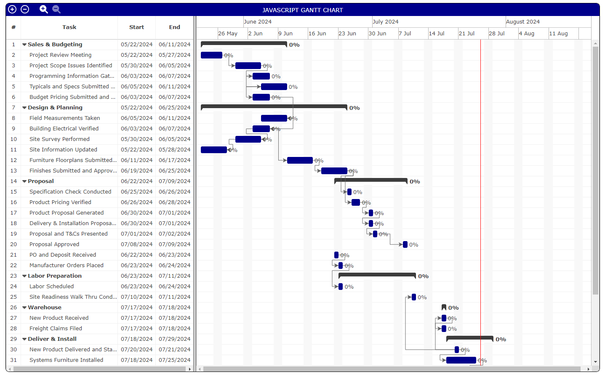

# JavaScript Gantt Chart

I built this Gantt charting solution from scratch using javascript.
Some of the built in features:
* Uses a JavaScript class for proper encapsulation.
* Click on sections headers to expand or collapse each section.
* On the top left, there are Expand All and Collapse All buttons.
* There are four zoom levels.
* The vertical splitter bar can be moved left and right and all scrollbars will adjust themselves appropriately.
* The connectors are dynamically created at render time onto an svg layer.
* The bars are simple div's so drag/drop/resize events could easily be added to them.

# Screenshot

